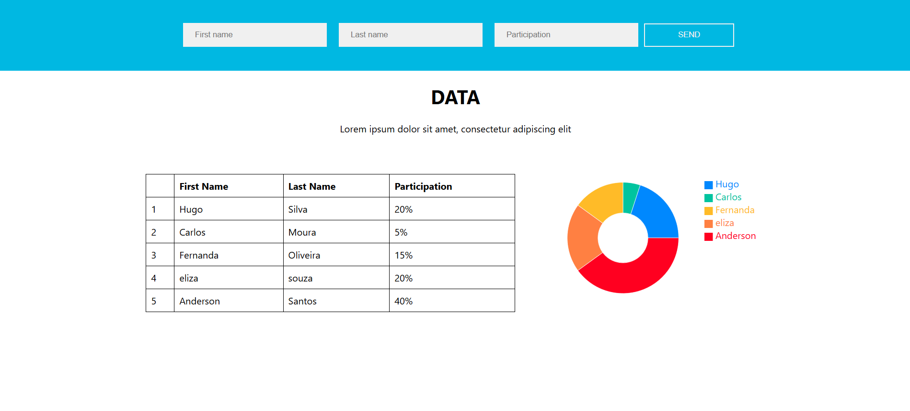

# { "developer": "fullstack" }

This project is a application using Django (backend) and React (frontend), containerized using Docker. <p>


## Technologies Used
- Backend: Django + SQLite
- Frontend: React
- Containers: Docker & Docker Compose

## Setup and Execution
1. Clone the repo using 
```sh 
git clone https://github.com/kaylanelira/fullstack-challenge
```

### Running the project
1. To run the project with Docker, use:
```sh 
docker-compose up --build -d
```
3. You can also run the application with:
```sh 
cd frontend
npm install
npm start
```
```sh 
cd backend
python manage.py runserver
```
### Access the Application on ports:
- Frontend: http://localhost:3000
- Backend: http://localhost:8000

### Stop Docker Containers
```sh 
docker-compose down
```

## Testing
You can also run frontend and backend tests.
### Frontend
Go to the **frontend** folder and run:
```sh
npm install
npm test
```

### Backend
Go to the **backend** folder and run:
```sh 
python manage.py test
```
